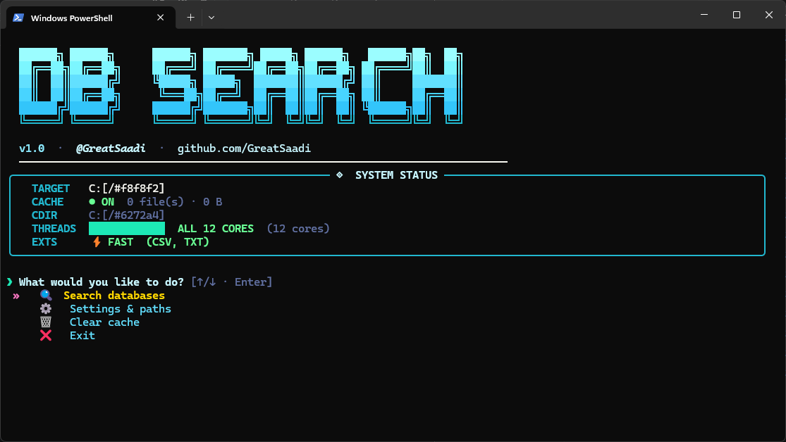

<div align="center">

# 🔍 DB Searcher

### Blazing-fast, multi-threaded, multi-format file & database search tool for your terminal

**by [@GreatSaadi](https://github.com/GreatSaadi)** · v1.0.0

[](https://www.python.org/)
[](https://github.com/Textualize/rich)
[]()
[]()

</div>

---

<p align="center">
  
  <br>
  <em>Replace <code>screenshot.png</code> with a real screenshot of the app running in your terminal.</em>
</p>

---

## 🌐 Language / زبان

| [🇬🇧 English](#-english) | [🇮🇷 فارسی](#-فارسی) |
|---|---|

---

# 🇬🇧 English

## ✨ What is DB Searcher?

**DB Searcher** is a gorgeous, interactive command-line application that lets you instantly search for any term across **thousands of files** — CSV, TXT, Excel, JSON, and SQLite/DB — inside a target folder (and all its subfolders). It's built for people who need to find "that one row" buried somewhere inside a massive pile of data dumps, exports, or backups, without opening a single file manually.

It combines a **dual-engine search system**, **multi-threaded parallel processing**, a **smart caching layer**, and a beautiful **Rich + Questionary** terminal UI with full **RTL/Persian text support**.

## 🚀 Key Features

- **🔎 Universal Search** — search a keyword across `.csv`, `.txt`, `.xlsx`, `.json`, `.db`, and `.sqlite` files at once.
- **⚡ Dual Search Engines**
  - **Fast Engine** — a lightweight line-by-line reader for `.csv` / `.txt` files (no pandas overhead, lowest memory, highest speed).
  - **Full Engine** — a pandas-powered engine for `.xlsx`, `.json`, `.db`, `.sqlite`, supporting multi-sheet Excel files, multi-table SQLite databases, and nested JSON.
- **🧵 Multi-threaded execution** — uses `ThreadPoolExecutor` to scan many files in parallel, with a configurable thread limit (or unlimited = all CPU cores).
- **💾 Smart Disk Cache** — converts heavy files (Excel/JSON/DB) into fast-loading `.pkl` caches so repeat searches are nearly instant; automatically detects when a source file has changed and refreshes the cache.
- **🧠 In-memory cache** — keeps recently used dataframes in RAM during a session for even faster repeat searches.
- **🔤 Persian / Arabic Text Normalization** — automatically unifies Arabic vs. Persian letter variants (ي→ی, ك→ک, etc.) and strips diacritics, so search results aren't missed due to typography differences.
- **🈂️ RTL Display Fix** — correctly reshapes and displays right-to-left (Persian/Arabic) text in the terminal table output using `arabic_reshaper` + `python-bidi`.
- **🎨 Beautiful Terminal UI** — built with [Rich](https://github.com/Textualize/rich) and [Questionary](https://github.com/tmbo/questionary): gradient ASCII logo, live system-status panel, animated progress bars, styled tables, and interactive arrow-key menus.
- **⌨️ Live Cancel** — press `Q` or `Esc` at any time during a scan to cancel it immediately, even mid-search.
- **📁 Recursive Directory Scan** — automatically walks through all subfolders of your target directory.
- **🛠️ Fully Configurable Settings**
  - Choose which file extensions are active (presets: CSV only, CSV+TXT, CSV+Excel, CSV+DB, All formats, or fully custom).
  - Toggle disk caching on/off.
  - Set or unlimit the number of worker threads.
  - Change the target search directory and the cache directory.
  - All settings persist in a local `cli_settings.json` file.
- **📤 CSV Export** — export your full result set to a CSV file with one keystroke.
- **🧹 Cache Manager** — view cache size/file count and clear it with a single command.
- **🖥️ Cross-platform** — works on Windows (with full UTF-8 console + color support), Linux, and macOS.

## 🧰 How It Works

1. **Pick your target folder** in *Settings → Change target directory*.
2. **Choose active file types** (CSV is fastest and the default).
3. Run **🔍 Search databases** from the main menu.
4. DB Searcher scans the directory recursively, separates files into the **Fast** group (csv/txt) and the **Full** group (xlsx/json/db/sqlite).
5. If caching is enabled, heavy files are first converted into `.pkl` cache files in parallel threads (only if the source file changed since the last run).
6. Type your search term — it's automatically normalized (Persian/Arabic aware) before matching.
7. Both engines run in parallel across multiple threads, showing a live progress bar per engine.
8. All matches are merged into a single results table showing the source file, sheet/table name, row number, and matching columns.
9. Optionally export everything to a clean CSV file.

## 📦 Requirements

```bash
pip install pandas rich questionary openpyxl arabic_reshaper python-bidi
```

A ready-made `requirements.txt` is included in the repo — the easiest way to install everything at once:

```bash
pip install -r requirements.txt
```

| Package | Purpose |
|---|---|
| `pandas` | Reading Excel / JSON / SQLite data |
| `rich` | Terminal UI: panels, tables, progress bars |
| `questionary` | Interactive arrow-key menus & prompts |
| `openpyxl` | Excel (`.xlsx`) engine for pandas |
| `arabic_reshaper` | Reshaping Persian/Arabic text for terminal display |
| `python-bidi` | Bidirectional (RTL) text rendering |

## ▶️ Usage

```bash
python Main.py
```

Then just use the **arrow keys + Enter** to navigate the menu:

```
❯ 🔍  Search databases
  ⚙️   Settings & paths
  🗑️   Clear cache
  ❌   Exit
```

## ⚙️ Settings Overview

| Setting | Description |
|---|---|
| **File extensions** | Choose which formats to include in scans (presets or custom checkbox list) |
| **Toggle cache** | Enable/disable the `.pkl` disk cache for heavy files |
| **Thread limit** | Set how many threads to use, or leave unlimited (all CPU cores) |
| **Target directory** | The root folder that gets scanned recursively |
| **Cache directory** | Where `.pkl` cache files are stored |

## ⌨️ Controls

| Key | Action |
|---|---|
| `↑ / ↓` | Navigate menus |
| `Enter` | Confirm selection |
| `Space` | Toggle checkbox items (custom extension picker) |
| `Q` or `Esc` | Cancel an in-progress search |
| `Ctrl+C` | Force cancel / go back |

## 📁 Project Structure

```
.
├── Main.py                 # The entire application
├── requirements.txt          # Python dependencies
├── cli_settings.json        # Auto-generated settings file (created on first run)
└── db_searcher_cache/        # Auto-generated cache folder (.pkl files)
```

## 👤 Author

**@GreatSaadi**
Arya : "Enjoying this project? Give it a star! ⭐ If you spot any bugs or have any feedback, I’d love to hear from you. 🤠"

---

# 🇮🇷 فارسی

## ✨ دی‌بی سرچر چیست؟

**DB Searcher** یک ابزار خط‌فرمان (CLI) بسیار زیبا و تعاملی است که به شما اجازه می‌دهد در عرض چند ثانیه، یک عبارت را در میان **هزاران فایل** از نوع CSV، TXT، اکسل (Excel)، JSON و دیتابیس‌های SQLite/DB، در یک پوشه هدف و تمام زیرپوشه‌های آن جست‌وجو کنید. این ابزار برای کسانی ساخته شده که باید یک رکورد خاص را در میان حجم عظیمی از فایل‌های دیتابیس، خروجی‌ها یا بکاپ‌ها پیدا کنند، بدون آنکه حتی یک فایل را به‌صورت دستی باز کنند.

این پروژه ترکیبی از یک **سیستم دو-موتوره جست‌وجو**، **پردازش موازی چندنخی (Multi-threading)**، یک **لایه کش هوشمند** و یک رابط کاربری خط‌فرمان فوق‌العاده زیبا با کتابخانه‌های **Rich** و **Questionary** است، که از **نمایش صحیح متن فارسی و راست‌به‌چپ (RTL)** نیز کاملاً پشتیبانی می‌کند.

## 🚀 امکانات کلیدی

- **🔎 جست‌وجوی فراگیر** — جست‌وجوی یک کلیدواژه در فایل‌های `.csv`، `.txt`، `.xlsx`، `.json`، `.db` و `.sqlite` به‌طور همزمان.
- **⚡ دو موتور جست‌وجوی مجزا**
  - **موتور سریع (Fast Engine)** — یک خوانندهٔ خطی و سبک برای فایل‌های `.csv` و `.txt` بدون نیاز به پانداز، با کمترین مصرف حافظه و بالاترین سرعت.
  - **موتور کامل (Full Engine)** — موتور مبتنی‌بر pandas برای فایل‌های `.xlsx`، `.json`، `.db` و `.sqlite`، با پشتیبانی از اکسل‌های چندشیتی، دیتابیس‌های چندجدولی و جیسون‌های تودرتو.
- **🧵 اجرای چندنخی** — استفاده از `ThreadPoolExecutor` برای اسکن همزمان چندین فایل، با امکان محدودسازی تعداد نخ‌ها یا استفادهٔ بی‌نهایت از تمام هسته‌های پردازنده.
- **💾 کش هوشمند روی دیسک** — فایل‌های سنگین (اکسل/جیسون/دیتابیس) را به فایل‌های `.pkl` تبدیل می‌کند تا جست‌وجوهای بعدی تقریباً آنی انجام شوند؛ و هرگاه فایل اصلی تغییر کند، کش به‌طور خودکار به‌روزرسانی می‌شود.
- **🧠 کش داخل حافظه (RAM)** — دیتافریم‌های اخیراً استفاده‌شده را در طول یک جلسه در حافظه نگه می‌دارد تا جست‌وجوهای تکراری سریع‌تر شوند.
- **🔤 نرمال‌سازی متن فارسی/عربی** — حروف عربی و فارسی مشابه (مثل ي→ی، ك→ک) را به‌طور خودکار یکسان‌سازی کرده و اعراب را حذف می‌کند تا نتایج به دلیل تفاوت‌های نوشتاری از قلم نیفتند.
- **🈂️ رفع مشکل نمایش راست‌به‌چپ** — متن فارسی/عربی با استفاده از `arabic_reshaper` و `python-bidi` به‌درستی در جدول خروجی ترمینال نمایش داده می‌شود.
- **🎨 رابط کاربری زیبا در ترمینال** — ساخته‌شده با کتابخانه‌های [Rich](https://github.com/Textualize/rich) و [Questionary](https://github.com/tmbo/questionary): لوگوی گرادیانی، پنل وضعیت سیستم زنده، نوار پیشرفت متحرک، جداول رنگی و منوهای تعاملی با کلیدهای جهت‌نما.
- **⌨️ لغو زندهٔ عملیات** — در هر لحظه از اسکن می‌توانید با فشردن `Q` یا `Esc` عملیات را فوراً لغو کنید.
- **📁 اسکن بازگشتی پوشه‌ها** — به‌طور خودکار تمام زیرپوشه‌های مسیر هدف را پیمایش می‌کند.
- **🛠️ تنظیمات کاملاً قابل شخصی‌سازی**
  - انتخاب پسوندهای فعال (پیش‌تنظیم‌های آماده: فقط CSV، CSV+TXT، CSV+Excel، CSV+DB، همهٔ فرمت‌ها، یا انتخاب کاملاً دستی).
  - فعال/غیرفعال‌کردن کش روی دیسک.
  - تعیین یا نامحدودکردن تعداد نخ‌های پردازشی.
  - تغییر پوشهٔ هدف جست‌وجو و پوشهٔ ذخیرهٔ کش.
  - همهٔ تنظیمات به‌طور خودکار در فایل `cli_settings.json` ذخیره می‌شوند.
- **📤 خروجی CSV** — تمام نتایج را با یک دستور به فایل CSV خروجی بگیرید.
- **🧹 مدیریت کش** — مشاهدهٔ حجم و تعداد فایل‌های کش و پاک‌سازی آن با یک کلیک.
- **🖥️ چندسکویی (Cross-platform)** — روی ویندوز (با پشتیبانی کامل از UTF-8 و رنگ در کنسول)، لینوکس و مک اجرا می‌شود.

## 🧰 نحوهٔ کار برنامه

۱. از منوی **تنظیمات → تغییر پوشهٔ هدف**، پوشهٔ مورد نظر خود را انتخاب کنید.
۲. **پسوندهای فعال** را مشخص کنید (پیش‌فرض و سریع‌ترین حالت: فقط CSV).
۳. از منوی اصلی، گزینهٔ **🔍 جست‌وجوی دیتابیس‌ها** را اجرا کنید.
۴. برنامه به‌طور بازگشتی پوشه را اسکن کرده و فایل‌ها را به دو گروه **سریع** (csv/txt) و **کامل** (xlsx/json/db/sqlite) تقسیم می‌کند.
۵. اگر کش فعال باشد، فایل‌های سنگین ابتدا به‌صورت موازی به فایل‌های کش `.pkl` تبدیل می‌شوند (فقط اگر فایل اصلی از آخرین اجرا تغییر کرده باشد).
۶. عبارت جست‌وجو را وارد کنید — این عبارت به‌طور خودکار نرمال‌سازی می‌شود (با درک حروف فارسی/عربی).
۷. هر دو موتور به‌صورت موازی و چندنخی اجرا می‌شوند و نوار پیشرفت زنده برای هر موتور نمایش داده می‌شود.
۸. تمام نتایج در یک جدول واحد نمایش داده می‌شوند که شامل نام فایل منبع، نام شیت/جدول، شماره ردیف و ستون‌های منطبق است.
۹. در صورت تمایل می‌توانید همهٔ نتایج را در یک فایل CSV تمیز ذخیره کنید.

## 📦 پیش‌نیازها

```bash
pip install pandas rich questionary openpyxl arabic_reshaper python-bidi
```

یک فایل `requirements.txt` آماده هم داخل پروژه قرار داره — ساده‌ترین راه برای نصب همه‌ی کتابخانه‌ها با یک دستور:

```bash
pip install -r requirements.txt
```

| کتابخانه | کاربرد |
|---|---|
| `pandas` | خوانش داده‌های اکسل، جیسون و SQLite |
| `rich` | رابط کاربری ترمینال: پنل‌ها، جداول، نوار پیشرفت |
| `questionary` | منوها و پرامپت‌های تعاملی با کلید جهت‌نما |
| `openpyxl` | موتور خوانش فایل‌های اکسل (`.xlsx`) برای pandas |
| `arabic_reshaper` | بازسازی شکل متن فارسی/عربی برای نمایش در ترمینال |
| `python-bidi` | رندر صحیح متن دوجهته (راست‌به‌چپ) |

## ▶️ نحوهٔ اجرا

```bash
python Main.py
```

سپس فقط با **کلیدهای جهت‌نما + Enter** در منو حرکت کنید:

```
❯ 🔍  جست‌وجوی دیتابیس‌ها
  ⚙️   تنظیمات و مسیرها
  🗑️   پاک‌کردن کش
  ❌   خروج
```

## ⚙️ نگاهی به تنظیمات

| تنظیم | توضیح |
|---|---|
| **پسوندهای فایل** | انتخاب فرمت‌هایی که در اسکن لحاظ می‌شوند (پیش‌تنظیم یا لیست انتخابی دستی) |
| **فعال/غیرفعال کش** | روشن یا خاموش‌کردن کش دیسکی `.pkl` برای فایل‌های سنگین |
| **محدودیت نخ‌ها** | تعیین تعداد نخ‌های پردازشی یا حالت نامحدود (تمام هسته‌ها) |
| **پوشهٔ هدف** | پوشهٔ ریشه‌ای که به‌طور بازگشتی اسکن می‌شود |
| **پوشهٔ کش** | محل ذخیرهٔ فایل‌های کش `.pkl` |

## ⌨️ کلیدهای میانبر

| کلید | عملکرد |
|---|---|
| `↑ / ↓` | حرکت در منوها |
| `Enter` | تأیید انتخاب |
| `Space` | فعال/غیرفعال‌کردن آیتم‌های چک‌باکس (انتخاب دستی پسوندها) |
| `Q` یا `Esc` | لغو جست‌وجوی در حال اجرا |
| `Ctrl+C` | لغو اجباری / بازگشت |

## 📁 ساختار پروژه

```
.
├── Main.py                 # کل برنامه
├── requirements.txt          # کتابخانه‌های مورد نیاز پایتون
├── cli_settings.json        # فایل تنظیمات (به‌صورت خودکار در اولین اجرا ساخته می‌شود)
└── db_searcher_cache/        # پوشهٔ کش (فایل‌های .pkl) که به‌صورت خودکار ساخته می‌شود
```

## 👤 سازنده

**@GreatSaadi**
«اگر از این پروژه خوشتون اومد، با یک ستاره (Star) ⭐ حمایتش کنید! اگر باگی دیدید یا پیشنهادی برای بهتر شدن پروژه دارید، حتماً با من در میون بگذارید. 🤠»
---

<div align="center">

Made with ❤️ and a lot of ☕ by **@GreatSaadi**

</div>
